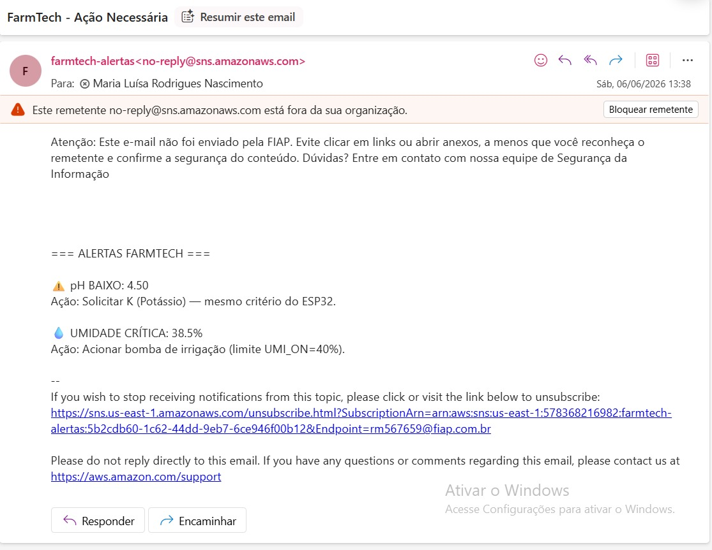
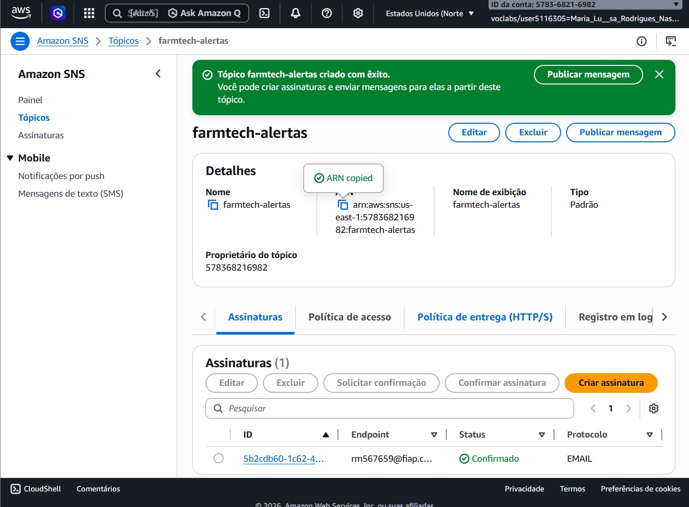

# FIAP - Faculdade de Informática e Administração Paulista


# A consolidação de um sistema — Fase 7, Capítulo 1

## 👨‍🎓 Integrantes
- [CAUAN OTTO RODRIGUES SOUSA (RM567940)](https://www.linkedin.com/in/cauanotto)
- [FERNANDO A GURGEL (RM567606)](https://www.linkedin.com/in/fernando-gurgel-75aa8369)
- [IRACI MONTEIRO SOUZA (RM567544)](https://www.linkedin.com/in/iraci-souza-bab42034)
- [MARIA LUISA RODRIGUES NASCIMENTO (RM567659)](https://www.linkedin.com/in/malu-rodrigues-bb756b271)
- [RAFAELA TORRES MARTINS (RM567735)](https://www.linkedin.com/in/rafaela-torres222)

## 👩‍🏫 Professores
- **Tutor(a):** [ANA CRISTINA DOS SANTOS](https://www.linkedin.com/company/inova-fusca)
- **Coordenador(a):** [ANDRÉ GODOI](https://www.linkedin.com/in/andregodoichiovato)

---

## 📌 Contexto

A **FarmTech Solutions** é uma empresa de tecnologia voltada ao agronegócio que consolidou, ao longo de 7 fases, um ecossistema digital completo da coleta de dados em sensores físicos até dashboards inteligentes em nuvem com alertas automatizados.
 
Este repositório representa a **Fase 7: A Consolidação**, onde todos os sistemas desenvolvidos anteriormente são integrados em um único projeto Python, acessível via dashboard interativa e infraestrutura AWS.

## 🗺️ Visão Geral do Projeto — Evolução por Fases
 
```
╔══════════════════════════════════════════════════════════════════════╗
║               ECOSSISTEMA FARMTECH SOLUTIONS                        ║
╠══════════════════════════════════════════════════════════════════════╣
║  📐 FASE 1    Base de Dados + API Meteorológica + Análise R          ║
║       ↓                                                              ║
║  🗃️  FASE 2    Banco de Dados Relacional (MER/DER + Oracle)         ║
║       ↓                                                              ║
║  🤖 FASE 3    IoT com ESP32 — Sensores + Automação de Irrigação     ║
║       ↓                                                              ║
║  📊 FASE 4    Dashboard ML com Streamlit + Scikit-Learn             ║
║       ↓                                                              ║
║  ☁️  FASE 5    Cloud AWS — Segurança (ISO 27001/27002) + RDS        ║
║       ↓                                                              ║
║  👁️  FASE 6    Visão Computacional — YOLOv5 para Detecção de Pragas ║
║       ↓                                                              ║
║  🔗 FASE 7    ✅ CONSOLIDAÇÃO — Integração Total + Alertas SNS/SES  ║
╚══════════════════════════════════════════════════════════════════════╝
```

---

## 📋 Detalhamento das Fases

### 📐 Fase 1 — Base de Dados + API Meteorológica + Análise R

Primeira etapa do ecossistema FarmTech. Implementa os cálculos agronômicos fundamentais e a integração com dados externos.

| Arquivo | Descrição |
|---------|-----------|
| `fase1/calculo_area.py` | Calcula área de plantio (retângulo, triângulo, círculo), consumo de insumos e capacidade produtiva por cultura |
| `fase1/api_meteorologica.py` | Consulta a API OpenWeatherMap e retorna probabilidade de chuva das 27 capitais brasileiras |
| `fase1/analise_r/` | Scripts R para análise estatística complementar (`Analise_dados_R.r`, `Desafio_API.r`) |

**Funcionalidades:** cálculo de área e insumos, estimativa de plantas por cultura (soja, milho, café, laranja), consulta climática em tempo real.

---

### 🗃️ Fase 2 — Banco de Dados Relacional

Modelagem e persistência dos dados agrícolas. Na consolidação, utiliza SQLite em memória para alta disponibilidade na dashboard.

| Arquivo | Descrição |
|---------|-----------|
| `fase2/banco_dados.py` | Cria tabelas `leituras` (sensores IoT) e `culturas` (soja, milho, café, laranja) |

**Funcionalidades:** conexão com banco relacional, CRUD de culturas e leituras de sensores.

---

### 🤖 Fase 3 — IoT com ESP32

Automação de irrigação e monitoramento de sensores. O código original em C++ (Wokwi/Arduino) foi portado para Python na Fase 7.

| Arquivo | Descrição |
|---------|-----------|
| `fase3/esp32_sensor_sim.py` | Simula leituras de umidade, pH, níveis NPK e controle da bomba d'água |

**Regras de irrigação:** bomba liga quando umidade < 40% ou pH < 5.5 — mesmos limites usados nos alertas AWS.

---

### 📊 Fase 4 — Dashboard ML com Streamlit + Scikit-Learn

Machine Learning aplicado à agricultura de precisão. Treina modelos de regressão para prever produtividade com base em umidade, pH e cultura.

| Arquivo / Pasta | Descrição |
|-----------------|-----------|
| `fase4/treinar_modelo.py` | Treina modelo de regressão linear e salva `modelo_agricola.pkl` |
| `fase4/front/main.py` | Dashboard Streamlit original da Fase 4 (previsão de produtividade) |
| `fase4/notebooks/` | Notebook Jupyter com análise exploratória (`fs4-cap1-ml-por-cultura.ipynb`) |
| `fase4/dados_finais_corretos.csv` | Base de dados para treinamento |
| `fase4/docker-compose.yml` | Orquestração do ambiente Jupyter via Docker |

**Funcionalidades:** previsão de produtividade (kg/ha), gráficos de correlação e performance do modelo.

---

### ☁️ Fase 5 — Cloud AWS (Segurança + Infraestrutura)

Infraestrutura em nuvem conforme ISO 27001/27002. Na Fase 7, os serviços AWS são consumidos diretamente pelos módulos de alerta.

| Serviço AWS | Finalidade |
|-------------|-----------|
| **EC2** | Hospedagem da dashboard Streamlit |
| **RDS (PostgreSQL)** | Banco de dados central em nuvem |
| **S3** | Armazenamento de imagens (Fase 6) |
| **IAM** | Controle de acesso e segurança |
| **CloudWatch** | Monitoramento e logs |

---

### 👁️ Fase 6 — Visão Computacional (YOLOv5)

Detecção de pragas e doenças em plantas usando YOLOv5 treinado com dataset próprio.

| Arquivo / Pasta | Descrição |
|-----------------|-----------|
| `fase6/yolo_derector.py` | Módulo de detecção integrado à dashboard (upload de imagem) |
| `fase6/best.pt` | Pesos do modelo treinado |
| `fase6/alertas_aws.py` | Envio de alertas via AWS SNS com regras de umidade, pH e pragas |
| `fase6/yolov5/` | Repositório YOLOv5 (detecção local) |
| `fase6/test/` | Imagens de teste (8 imagens inéditas) |
| `fase6/output/` | Resultados anotados das detecções |

**Classes detectadas:** `healthy` (saudável) e `diseased` (doente/com praga).

---

### 🔗 Fase 7 — Consolidação (este repositório)

Integração de todas as fases anteriores em um único ponto de entrada Python com dashboard interativa e alertas automatizados.

| Arquivo | Descrição |
|---------|-----------|
| `teste_dashboard.py` | Dashboard principal — integra Fases 1, 2, 3, 5 e 6 em abas |
| `fase6/alertas_aws.py` | Serviço de alertas AWS (SNS) com regras consolidadas |
| `docs/aws/` | Evidências de funcionamento (e-mail e tópico SNS) |

---

## 🖥️ Dashboard Integrada (`teste_dashboard.py`)

A dashboard da Fase 7 centraliza o acesso a todos os módulos do sistema em uma interface Streamlit com **5 abas**:

| Aba | Fase | O que faz |
|-----|------|-----------|
| **Fase 1 (Cálculos)** | 1 | Calcula área de plantio, insumos e capacidade produtiva. Parâmetros na sidebar: umidade, pH, formato da área, cultura, produto e dose |
| **Fase 2 (Banco/Clima)** | 2 + 1 | Testa conexão com banco SQLite e exibe tabela com dados climáticos das capitais via API OpenWeatherMap |
| **Fase 3 (IoT)** | 3 | Simula leitura dos sensores ESP32 (umidade, pH, NPK, status da bomba) |
| **Fase 5 (Alertas)** | 5 + 6 | Envia alertas personalizados via AWS SNS. Também acionado automaticamente pelas regras de umidade, pH e detecção de pragas |
| **Fase 6 (YOLO)** | 6 | Upload de imagem de planta → detecção de pragas com YOLOv5 → exibe resultado, JSON de detecções e imagem anotada |

### Evolução em relação à Fase 4

| Módulo | Antes (Fase 4) | Depois (Fase 7) |
|--------|---------------|-----------------|
| **Navegação** | Interface estática | Unificação em abas |
| **Dados em tempo real** | Dados estáticos | API dinâmica + Banco SQLite |
| **Alertas** | Ausentes | E-mail via AWS SNS |
| **Visão Computacional** | Isolado no Colab | Integrado no front-end |
| **IoT** | C++ (Arduino) | Python (simulação) |
| **Relatórios** | Terminal interativo | Tabela e JSON interativos |

### Estrutura do Projeto

```
Fase07-Cap01/
├── teste_dashboard.py         ← Ponto de entrada principal (dashboard integrada)
├── requirements.txt           ← Dependências do projeto
├── fase1/
│   ├── calculo_area.py        ← Cálculos de plantio e insumos
│   ├── api_meteorologica.py   ← Integração com API de clima
│   └── analise_r/             ← Scripts R para análise estatística
├── fase2/
│   └── banco_dados.py         ← Banco relacional SQLite
├── fase3/
│   └── esp32_sensor_sim.py    ← Simulação ESP32
├── fase4/
│   ├── front/main.py          ← Dashboard ML original (Fase 4)
│   ├── treinar_modelo.py      ← Treinamento do modelo
│   └── notebooks/             ← Jupyter Notebooks
├── fase6/
│   ├── yolo_derector.py       ← Detecção de pragas (YOLOv5)
│   ├── alertas_aws.py         ← Alertas AWS SNS
│   ├── best.pt                ← Modelo treinado
│   └── yolov5/                ← Framework YOLOv5
└── docs/aws/
    ├── email_alerta.png       ← Evidência de e-mail recebido
    └── sns_topico.png         ← Evidência do tópico SNS
```

---

### ✅ Serviço de Alertas AWS
 
> Implementado novo serviço de mensageria que monitora os dados dos sensores e da visão computacional, disparando alertas automáticos por **e-mail** e **SMS** para os funcionários da fazenda.
 
#### Arquitetura do Serviço de Alertas
 
```
Sensores IoT (Fase 3)         Visão Computacional (Fase 6)
      │                                  │
      ▼                                  ▼
┌─────────────────────────────────────────────────┐
│              AWS Lambda (Processamento)         │
│  - Verifica umidade → inteligência irrigação    │
│  - Detecta pH fora da faixa → correção          │
│  - Identifica praga na imagem → inspecionar     │
└──────────────────────┬──────────────────────────┘
                       │
          ┌────────────┼────────────┐
          ▼            ▼            ▼
      AWS SNS      AWS SES      Dashboard
     (SMS/Push)   (E-mail)    (Notificação
                               visual)
```
 
#### Regras de Alerta Implementadas

| Sensor / Análise | Condição de Alerta | Ação Sugerida | Canal |
|---|---|---|---|
| Umidade do Solo | `<= 40.0%` | Acionar bomba de irrigação (limite `UMI_ON=40%`) | E-mail |
| pH do Solo | `< 4.8` | Solicitar K (Potássio) | E-mail |
| pH do Solo | `> 6.2 e < 8.0` | Solicitar N (Nitrogênio) | E-mail |
| pH do Solo | `>= 8.0` | Solicitar P (Fósforo) | E-mail |
| Visão Computacional (YOLO) | Praga detectada (`praga_detectada=True`) | Acionar equipe de defensivos agrícolas | E-mail |

> Observação: quando um ou mais alertas são identificados, o sistema consolida as ocorrências e envia uma notificação com o assunto 
 
#### Exemplo de E-mail de Alerta
 
```
─────────────────────────────────────────────────
  🌾 FARMTECH SOLUTIONS — ALERTA AGRÍCOLA
─────────────────────────────────────────────────
  NÍVEL: ⚠️ ATENÇÃO
  DATA/HORA: 27/05/2026 14:32
 
  📍 Setor: Talhão 3 — Soja
  🔴 Problema: Umidade do solo = 22% (abaixo do mínimo)
 
  ✅ AÇÃO RECOMENDADA:
  Acionar bomba de irrigação por 45 minutos.
  Verificar filtros do sistema antes de ligar.
 
  🔗 Acessar Dashboard: https://farmtech.aws.com
─────────────────────────────────────────────────
```


#### Comprovação de Funcionamento

O serviço foi testado com sucesso via AWS Learner Lab. 
O e-mail abaixo foi recebido após execução do `alertas_aws.py` com leituras críticas simuladas:

> 📸 

**Remetente:** `farmtech-alertas <no-reply@sns.amazonaws.com>`  
**Destinatário:** e-mail institucional FIAP do grupo  
**Alertas disparados:**
- ⚠️ pH BAIXO: 4.50 → Solicitar K (Potássio)
- 💧 UMIDADE CRÍTICA: 38.5% → Acionar bomba de irrigação

## 🏗️ Arquitetura Geral do Sistema


## 🚀 Como Executar
 
### Pré-requisitos
 
- **Python 3.10+**
- **pip** instalado
- **Conta AWS** configurada (para alertas SNS — opcional)
- **Git** (para clonar o repositório)
- **Arduino IDE** (opcional — apenas para ESP32 físico)
- **R** (opcional — para scripts da Fase 1 em `fase1/analise_r/`)
- **Docker** (opcional — para ambiente Jupyter da Fase 4)

### Instalação

```bash
# 1. Clone o repositório
git clone https://github.com/fiap-ia-trabalho/farmtech-fase7.git
cd farmtech-fase7

# 2. Crie e ative o ambiente virtual
python -m venv venv
source venv/bin/activate        # Linux/Mac
venv\Scripts\activate           # Windows

# 3. Instale as dependências
pip install -r requirements.txt
```

### Lista de Dependências (`requirements.txt`)

| Biblioteca | Versão mínima | Fase | Finalidade |
|------------|---------------|------|-----------|
| `streamlit` | 1.32 | 4, 7 | Dashboard interativa |
| `pandas` | 2.1 | 1, 2, 4 | Manipulação de dados |
| `requests` | 2.32 | 1 | API meteorológica (OpenWeatherMap) |
| `numpy` | 1.23 | 4, 6 | Operações numéricas |
| `scikit-learn` | 1.4 | 4 | Machine Learning (regressão) |
| `joblib` | 1.3 | 4 | Serialização do modelo `.pkl` |
| `matplotlib` | 3.3 | 4 | Gráficos de performance |
| `seaborn` | 0.11 | 4 | Gráficos de correlação |
| `boto3` | 1.34 | 5, 6 | AWS SDK (SNS) |
| `torch` | 2.0 | 6 | YOLOv5 — inferência |
| `torchvision` | 0.9 | 6 | YOLOv5 — transformações de imagem |
| `opencv-python` | 4.6 | 6 | Visão computacional |
| `pillow` | 10.3 | 6 | Processamento de imagens |
| `PyYAML` | 5.3 | 6 | Configuração YOLOv5 |
| `tqdm` | 4.66 | 6 | Barra de progresso |
| `ultralytics` | 8.4 | 6 | Framework YOLO |
| `python-dotenv` | 1.0 | 7 | Variáveis de ambiente |

> **Opcional:** `rpy2` para executar os scripts R da Fase 1 diretamente do Python.

### Configuração AWS (alertas)

As credenciais AWS ficam em `fase6/alertas_aws.py` (ou em `config_aws.py`, não versionado). No AWS Learner Lab, atualize as chaves a cada sessão:

```python
AWS_ACCESS_KEY_ID     = "sua_chave"
AWS_SECRET_ACCESS_KEY = "sua_chave_secreta"
AWS_SESSION_TOKEN     = "seu_token"       # necessário no Learner Lab
AWS_REGION            = "us-east-1"
SNS_TOPIC_ARN         = "arn:aws:sns:us-east-1:XXXX:farmtech-alertas"
```

### Executando a Dashboard Integrada

```bash
# Iniciar dashboard principal (integra Fases 1, 2, 3, 5 e 6)
streamlit run teste_dashboard.py
```

Acesse `http://localhost:8501` no navegador.

### Executando a Dashboard ML da Fase 4 (standalone)

```bash
cd fase4/front
streamlit run main.py
```

### Executando Módulos Individualmente via Terminal

```bash
# Fase 1 — Cálculo de área e insumos
python fase1/calculo_area.py

# Fase 1 — API meteorológica
python fase1/api_meteorologica.py

# Fase 2 — Banco de dados
python fase2/banco_dados.py

# Fase 3 — Simulação de sensores IoT
python fase3/esp32_sensor_sim.py

# Fase 4 — Treinar modelo de ML
python fase4/treinar_modelo.py

# Fase 6 — Detecção de pragas com YOLO (lote de imagens)
python fase6/yolo_derector.py

# Fase 6/7 — Testar envio de alertas AWS
python fase6/alertas_aws.py
```

---
 
## ☁️ Serviço de Alertas AWS — Evidências

### Configuração do Tópico SNS

1. Acesse o console AWS → SNS → Topics
2. Criamos o tópico `farmtech-alertas` (tipo: Standard, região: us-east-1)
3. Adicionamos subscription com Protocol: Email, Endpoint: e-mail do grupo

> 📸 

### Arquivo de integração — `fase6/alertas_aws.py`

O serviço é chamado diretamente pela dashboard ou via terminal:

```bash
python fase6/alertas_aws.py
```

As credenciais ficam em `config_aws.py` (não versionado — listado no `.gitignore`):

```python
AWS_ACCESS_KEY_ID     = "sua_chave"
AWS_SECRET_ACCESS_KEY = "sua_chave_secreta"
AWS_SESSION_TOKEN     = "seu_token"       # necessário no Learner Lab
AWS_REGION            = "us-east-1"
SNS_TOPIC_ARN         = "arn:aws:sns:us-east-1:XXXX:farmtech-alertas"
```

> ⚠️ As credenciais do Learner Lab expiram a cada sessão e devem ser atualizadas antes de executar.
 
### Serviços AWS Utilizados
 
| Serviço | Finalidade | Fase |
|---------|-----------|------|
| **EC2** | Hospedagem da dashboard Streamlit | 5 |
| **RDS (PostgreSQL)** | Banco de dados central em nuvem | 5 |
| **S3** | Armazenamento de imagens (Fase 6) | 5 |
| **SNS** | Envio de SMS de alerta | 7 |
| **SES** | Envio de e-mails de alerta | 7 |
| **Lambda** | Processamento serverless das regras de alerta | 7 |
| **CloudWatch** | Monitoramento e logs do sistema | 5 + 7 |
| **IAM** | Controle de acesso (ISO 27001) | 5 |
 
---
 
## 📊 Dataset — Visão Computacional (Fase 6)
 
```
FIAP/
├── images/
│   ├── train/      (124 imagens: 74 saudáveis + 50 doentes)
│   ├── val/        (10 imagens: 5 saudáveis + 5 doentes)
│   └── test/       (8 imagens inéditas: 4 saudáveis + 4 doentes)
├── labels/
│   ├── train/      (arquivos .txt com bounding boxes YOLOv5)
│   └── val/        (arquivos .txt com bounding boxes YOLOv5)
└── plantas.yaml    (configuração do dataset)
```
 
**Classes detectadas:**
- 🟢 `healthy` — Planta saudável
- 🔴 `diseased` — Planta com doença ou praga
---
 
## 🎬 Vídeo Demonstrativo
 
📹 [Assistir no YouTube](https://youtu.be/gni1MdCpAXg)
 
> Vídeo de até 10 minutos demonstrando todas as funcionalidades das Fases 1 a 7, incluindo:
> - Execução da dashboard integrada
> - Demonstração dos sensores IoT (simulados)
> - Detecção de pragas com YOLOv5
> - Disparo de alertas por SMS e e-mail via AWS
 


